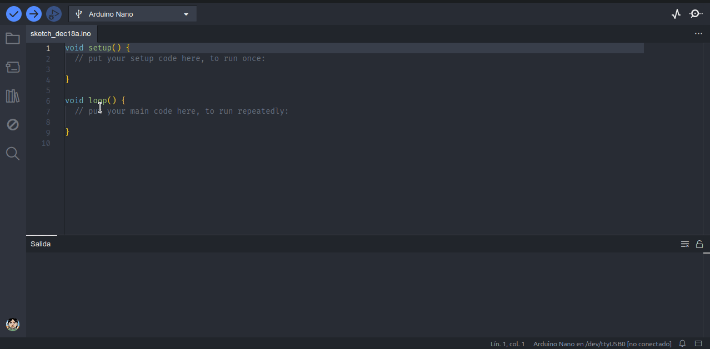

# Biblioteca Robotec

Biblioteca para trabajar con robótica educativa bajo la competencia [Robotec](https://robotecc.carrd.co/). Podes leer una breve reseña de la competencia en mi blog: [Robotec, una competencia de robótica escolar](https://www.automatismos-mdq.com.ar/blog/2024/01/robotec-una-competencia-de-robotica-escolar.html).

Actualmente soporta los siguientes dispositivos:

- Motor DC con drivers L293 y L298
- Sensor de distancia por ultrasonidos (HC-SR04 y similares)
- Sensor de proximidad por infrarrojos simple (Tracking y similares)
- Sensor de proximidad por infrarrojos triple (Funduino y similares)
- LED de uso general
- Pulsador de uso general

## Hardware

El diseño del hardware esta atado a las reglas de la compentencia. En el repositorio [*Proyectos Educativos*](https://github.com/lmtreser/Proyectos-Educativos/tree/main/Robotec) hay algunos ejemplos.

## Instalación

La biblioteca se puede instalar clonando este repositorio, o desde el *Gestor de Bibliotecas* de Arduino IDE.

## Documentación

En el directorio [**docs**](https://lmtreser.github.io/Robotec/) se encuentra disponible la documentación de las clases y pinouts de los diferentes dispositivos. Además en el directorio **examples** hay varios ejemplos simples para una rápida implementación.

## ToDo

- [ ] [#3:](https://github.com/lmtreser/Robotec/issues/3#issue-2079956506) agregar soporte para sensor de proximidad por infrarrojos [TCRT5000L de 5 vías](https://www.instructables.com/5-Ways-TCRT5000-Tracking-Sensor-Module-Tutorial/)
- [ ] [#4:](https://github.com/lmtreser/Robotec/issues/4#issue-2079958877) probar el funcionamiento con diferentes configuraciones de hardware
- [ ] [#5:](https://github.com/lmtreser/Robotec/issues/5) agregar soporte para encoders
- [x] [#6:](https://github.com/lmtreser/Robotec/issues/6) verificar la organización del código

## Licencia

Este trabajo está protegido por la **Licencia MIT**. Puedes acceder a la versión original de la licencia (en inglés) a través del archivo [LICENSE](./LICENSE) o en línea en [The MIT License (MIT)](https://mit-license.org/). También proporcionamos una traducción no oficial desde [Wikipedia](https://es.m.wikipedia.org/wiki/Licencia_MIT#La_licencia):

Copyright (c) 2024 Lucas Martín Treser

Por la presente se concede permiso, libre de cargos, a cualquier persona que obtenga una copia de este software y de los archivos de documentación asociados (el "Software"), a utilizar el Software sin restricción, incluyendo sin limitación los derechos a usar, copiar, modificar, fusionar, publicar, distribuir, sublicenciar, y/o vender copias del Software, y a permitir a las personas a las que se les proporcione el Software a hacer lo mismo, sujeto a las siguientes condiciones:

El aviso de copyright anterior y este aviso de permiso se incluirán en todas las copias o partes sustanciales del Software.

EL SOFTWARE SE PROPORCIONA "COMO ESTÁ", SIN GARANTÍA DE NINGÚN TIPO, EXPRESA O IMPLÍCITA, INCLUYENDO PERO NO LIMITADO A GARANTÍAS DE COMERCIALIZACIÓN, IDONEIDAD PARA UN PROPÓSITO PARTICULAR E INCUMPLIMIENTO. EN NINGÚN CASO LOS AUTORES O PROPIETARIOS DE LOS DERECHOS DE AUTOR SERÁN RESPONSABLES DE NINGUNA RECLAMACIÓN, DAÑOS U OTRAS RESPONSABILIDADES, YA SEA EN UNA ACCIÓN DE CONTRATO, AGRAVIO O CUALQUIER OTRO MOTIVO, DERIVADAS DE, FUERA DE O EN CONEXIÓN CON EL SOFTWARE O SU USO U OTRO TIPO DE ACCIONES EN EL SOFTWARE.
